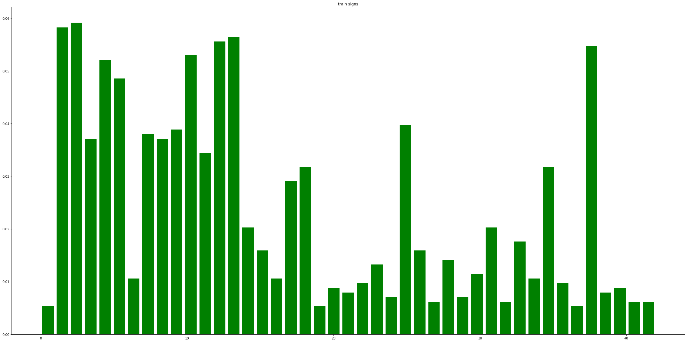
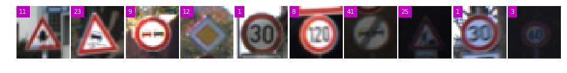
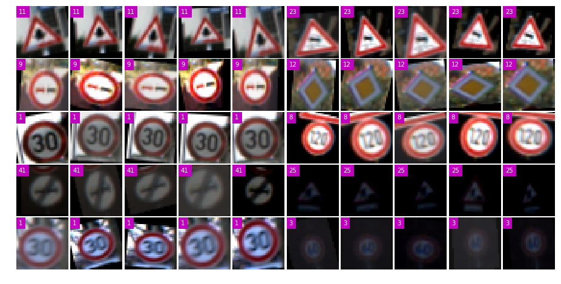
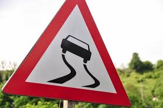
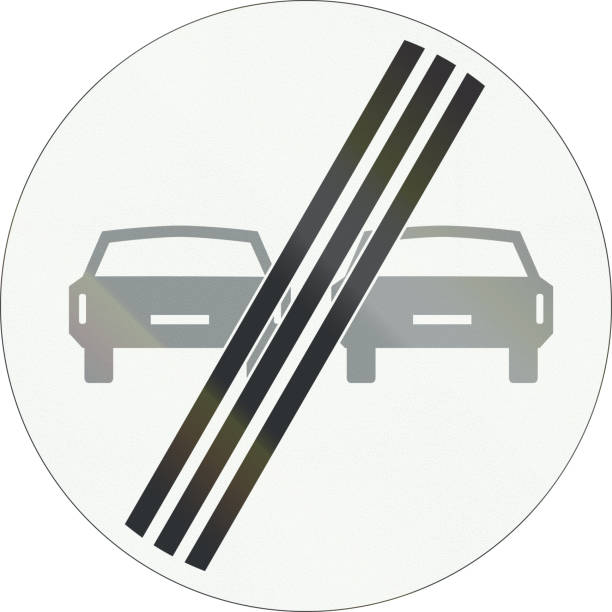
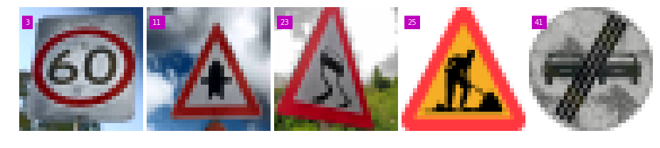
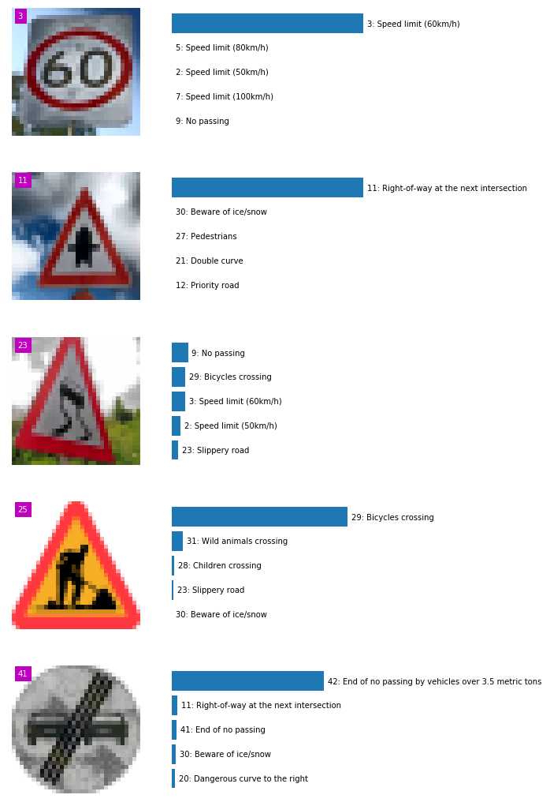

## 42Traffic Sign Recognition Writeup

---

### Build a Traffic Sign Recognition Project

The goals / steps of this project are the following:
* Load the data set (see below for links to the project data set)
* Explore, summarize and visualize the data set
* Design, train and test a model architecture
* Use the model to make predictions on new images
* Analyze the softmax probabilities of the new images
* Summarize the results with a written report


[//]: # "Image References"

[image1]: ./examples/visualization.jpg "Visualization"
[image2]: ./examples/grayscale.jpg "Grayscaling"
[image3]: ./examples/random_noise.jpg "Random Noise"
[image4]: ./examples/placeholder.png "Traffic Sign 1"
[image5]: ./examples/placeholder.png "Traffic Sign 2"
[image6]: ./examples/placeholder.png "Traffic Sign 3"
[image7]: ./examples/placeholder.png "Traffic Sign 4"
[image8]: ./examples/placeholder.png "Traffic Sign 5"

## Rubric Points
###Here I will consider the [rubric points](https://review.udacity.com/#!/rubrics/481/view) individually and describe how I addressed each point in my implementation.  

---
###Writeup / README

####1. Provide a Writeup / README that includes all the rubric points and how you addressed each one. You can submit your writeup as markdown or pdf. You can use this template as a guide for writing the report. The submission includes the project code.

You're reading it! and here is a link to my [project code]( https://github.com/hapuhundre/Traffic_Sign_Classifier)

###Data Set Summary & Exploration

####1. Provide a basic summary of the data set. In the code, the analysis should be done using python, numpy and/or pandas methods rather than hardcoding results manually.

I use numpy to summary the dataset. Traffic images have low image resolution (32x32x3)

```dataset.shape[0]```

####2. Include an exploratory visualization of the dataset.

Here is an exploratory visualization of the data set. It is a bar chart showing how the data is unbalanced.



###Design and Test a Model Architecture

####1. Describe how you preprocessed the image data. What techniques were chosen and why did you choose these techniques? Consider including images showing the output of each preprocessing technique. Pre-processing refers to techniques such as converting to grayscale, normalization, etc. (OPTIONAL: As described in the "Stand Out Suggestions" part of the rubric, if you generated additional data for training, describe why you decided to generate additional data, how you generated the data, and provide example images of the additional data. Then describe the characteristics of the augmented training set like number of images in the set, number of images for each class, etc.)

As a first step, I decided to generate additional data because there not enough pictures to train a good model to satisfy the 93% validation accuracy  

Here is an example of a traffic sign image before and after data augmentation.

​                                                               raw images



To add more data to the the data set, I used python library `imgaug`.This python library helps me with augmenting images for my images classification projects. It converts a set of input images into a new, much larger set of slightly altered images.

The difference between the original data set and the augmented data set is apply affine transformations to each image. Scale/zoom, translate/move , rotate and shear.

​                                                        augmented images




####2. Describe what your final model architecture looks like including model type, layers, layer sizes, connectivity, etc.) Consider including a diagram and/or table describing the final model.

My final model consisted of the following layers:

|             Layer             |               Description                |
| :---------------------------: | :--------------------------------------: |
|             Input             |            32x32x3 RGB image             |
| L1: Convolution 5x5 with RELU | 1x1 stride, same padding, outputs 32x32x32 |
|          Max pooling          |      2x2 stride,  outputs 16x16x32       |
| L2: Convolution 5x5 with RELU | 1x1 stride, same padding, outputs 16x16x64 |
|          Max pooling          |       2x2 stride,  outputs 8x8x64        |
| L3: Convolution 5x5 with RELU | 1x1 stride, same padding, outputs 8x8x128 |
|          Max pooling          |       2x2 stride,  outputs 4x4x128       |
|      L4: Fully Connected      |   Input = 4x4x128 = 2048. Output = 256   |
|            Dropout            |             keep_prob = 0.5              |
|      L5: Fully Connected      |        Input = 256. Output = 128         |
|            Dropout            |             keep_prob = 0.5              |
|      L6: Fully Connected      |         Input = 128. Output = 43         |


####3. Describe how you trained your model. The discussion can include the type of optimizer, the batch size, number of epochs and any hyperparameters such as learning rate.

To train the model, I used an Adam Optimizer, batch size is 128, and number of epochs is 10 (because I use the laptop to train the model, I first choose 25 epochs but it cost lots of time). learning rate is 0.001, drop out keep probability is 0.5.

####4. Describe the approach taken for finding a solution and getting the validation set accuracy to be at least 0.93. Include in the discussion the results on the training, validation and test sets and where in the code these were calculated. Your approach may have been an iterative process, in which case, outline the steps you took to get to the final solution and why you chose those steps. Perhaps your solution involved an already well known implementation or architecture. In this case, discuss why you think the architecture is suitable for the current problem.

My final model results were:
* training set accuracy of 97.06%
* validation set accuracy of 96.36% 
* test set accuracy of 94.63%

If an iterative approach was chosen:
* What was the first architecture that was tried and why was it chosen?

  I first choose the LeNet5 as my CNN architecture, and got a not good validation accuracy (74%),so I think add convolution layers and use dropout is alternated to get higher accuracy.

* What were some problems with the initial architecture?

  No dropout to avoid overfitting. And its not deep enough to get image features.

* How was the architecture adjusted and why was it adjusted? Typical adjustments could include choosing a different model architecture, adding or taking away layers (pooling, dropout, convolution, etc), using an activation function or changing the activation function. One common justification for adjusting an architecture would be due to overfitting or underfitting. A high accuracy on the training set but low accuracy on the validation set indicates over fitting; a low accuracy on both sets indicates under fitting.

* Which parameters were tuned? How were they adjusted and why?

  learning rate, I think learning rate is the significant parameter for deep learning model, because learning rate could have influence on gradient decent training.

* What are some of the important design choices and why were they chosen? For example, why might a convolution layer work well with this problem? How might a dropout layer help with creating a successful model? 

  I used to choose a more complicated CNN model (with inception) without data augmentation, and validation accuracy is extremely low....  Dropout layer could make model have higher generation ability.

If a well known architecture was chosen:
* What architecture was chosen?

  Compared LeNet5, I add a CNN layer and a fully connected layer, and add Dropout operation.

* Why did you believe it would be relevant to the traffic sign application?

  Because traffic signs have more complicated features to get by using convolution operation.

* How does the final model's accuracy on the training, validation and test set provide evidence that the model is working well?

  I have enough training data, good CNN model.


###Test a Model on New Images

####1. Choose five German traffic signs found on the web and provide them in the report. For each image, discuss what quality or qualities might be difficult to classify.

Here are five German traffic signs that I found on the web:

.jpg)







These images might be difficult to classify because my model doesn't use grayscale.



####2. Discuss the model's predictions on these new traffic signs and compare the results to predicting on the test set. At a minimum, discuss what the predictions were, the accuracy on these new predictions, and compare the accuracy to the accuracy on the test set (OPTIONAL: Discuss the results in more detail as described in the "Stand Out Suggestions" part of the rubric).

Here are the results of the prediction:

|                  Image                   | Prediction |
| :--------------------------------------: | :--------: |
|       03_Speed-limit-(60km-per-h)        |     03     |
| 11_Right-of-way-at-the-next-intersection |     11     |
|             23_Slippery_road             |     9      |
|               25_road_work               |     29     |
|           41_End-of-no-passing           |     42     |


The model was able to correctly guess 2 of the 5 traffic signs, which gives an accuracy of 40%. I think these new images have large difference between training dataset.

####3. Describe how certain the model is when predicting on each of the five new images by looking at the softmax probabilities for each prediction. Provide the top 5 softmax probabilities for each image along with the sign type of each probability. (OPTIONAL: as described in the "Stand Out Suggestions" part of the rubric, visualizations can also be provided such as bar charts)

The code for making predictions on my final model is located in the 11th cell of the Ipython notebook.

The top five soft max probabilities were:




